<h1 align=center>数据库项目报告</h1>

<h1 align=center>SHARE —— 一个朋友圈式的图文分享小程序</h1>

<h1 align=center>何泽    18340052  &  周思宇  18340028</h1>

> 我们这个项目的代码已经在GitHub上开源，仓库链接为https://github.com/He-Ze/SHARE ，仓库里除了代码还有最终成果的[演示视频](https://github.com/He-Ze/SHARE/blob/master/演示视频.mp4) 。

<h2 align=center>目录</h2>

[TOC]

## 一、项目背景与简介

现如今，随着5G的大力发展，分享类软件被推上了风口，不论是微博、小红书等图文类分享APP还是抖音、快手等短视频分享APP都异常火爆，甚至包括微信的朋友圈，分享日常似乎成为了人们的日常，可是这些APP大多有着非常复杂的界面或者扰人的广告，会使我们的使用体验下降；而朋友圈虽然很简洁但是却只能在自己的联系人中分享。

鉴于以上原因，我们便想设计一款简洁的并且可以在陌生人间分享图文消息的微信小程序。

## 二、项目开发内容与功能

- 以微信昵称和头像登录
- 可以发表图文消息
- 可以查看所有人所发送消息的内容、发送人昵称、发送人头像、发送时间以及点赞数
- 可以对别人的消息点赞
- 可以对所有图文进行排序，可以依据发布时间或者点赞数量从高到低进行排序

## 三、系统运行环境

我们使用了微信推出的云开发，云开发的官方介绍在[这里](https://developers.weixin.qq.com/miniprogram/dev/wxcloud/basis/getting-started.html)，微信云开发为开发者提供完整的原生云端支持和微信服务支持，弱化后端和运维概念，无需搭建服务器，使用平台提供的 API 进行核心业务开发，即可实现快速上线和迭代，同时这一能力，同开发者已经使用的云服务相互兼容，并不互斥。

我们选择云开发主要是因为有如下这几个功能：

|  能力  |        作用        |                             说明                             |
| :----: | :----------------: | :----------------------------------------------------------: |
| 云函数 |   无需自建服务器   | 在云端运行的代码，微信私有协议天然鉴权，开发者只需编写自身业务逻辑代码 |
| 数据库 |   无需自建数据库   |  一个既可在小程序前端操作，也能在云函数中读写的 JSON 数据库  |
|  存储  | 无需自建存储和 CDN | 在小程序前端直接上传/下载云端文件，在云开发控制台可视化管理  |
| 云调用 |  原生微信服务集成  | 基于云函数免鉴权使用小程序开放接口的能力，包括服务端调用、获取开放数据等能力 |

我们考虑到了它的便携性，可以更方便地操作数据库，于是选择了云开发，免费的配额如下：

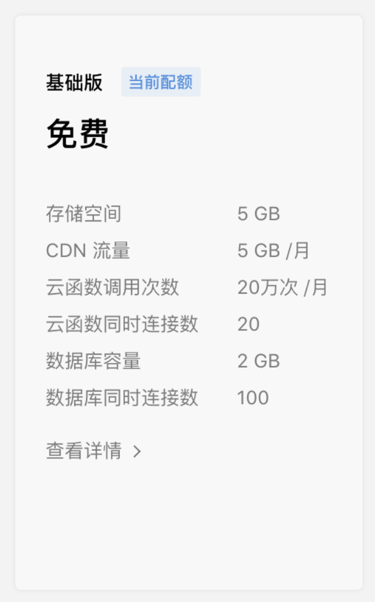

## 四、技术路线与体系结构

### 1. 数据库部分

#### ①  数据库简介

首先声明的一点是我们微信小程序提供给我们的数据库并不是一个关系数据库。微信小程序提供的的是非关系型数据库*mongodb*，对集合的创建比较简单，就是json数据，不像关系型数据库那样对数据结构有非常高的要求。其实我们是有一点想用关系数据库来验证课本上学习到的知识的，但是没有好的服务器我们选择了免费的微信小程序提供的云开发功能中的数据库功能。

#### ②  数据库选择

我们使用的数据库为非关系型数据库，是非关系型数据库中的*MongoDB*。和我们课上学的关系数据库可能有比较大的不同。我们为什么选择这个非关系型数据库呢？首先第一个原因是方便。我们没有自己的服务器，同时微信开发平台也给我们提供了这个数据库以及这个数据库的一些使用方法，而且它提供的这个非关系型数据库也是非关系型数据库中最接近关系型数据库的，操作上有很多的共同点。

然后我们这次使用的数据库，是文档型数据库。这种数据库存储的一般是类似*json*格式，然后寻找数据一般是使用*key-value*对进行查询。这种文档型数据库优点在于不需要有固定的结构，操作和编程比较简单易于上手。在我们这种比较简单的应用中是非常容易使用的。而且其是面向集合存储，所以我们会在介绍数据库的时候反复提到“集合”这个名词。它对于处理网页的数据是比较容易的，但是数据比较大的时候劣势也是比较大，性能是不如*sql*的。如果以后有服务器，还是用*sql*才会更好。

#### ③  数据库集合设计

需要提醒的一点是为了方便起见，如果我们不设置\_id，那么数据库里面的每一个数据都会自动生成一个\_id作为唯一标识。我们就使用这个唯一标识作为数据库的生成。虽然后面我们验证得知*usrid*也就是我们存储的用户的*openid*是这个用户的唯一标识，但是一个用户可以发送很多条不一样的信息，所以并不能成为唯一标识。

#### ④  数据库需求分析

根据我们的设计，我们不追求像其他小程序那样有着非常多的功能，我们只需要点赞和评论功能就够了。事实上，我们看到，许多微信小程序反而是因为功能太多而造成手机的一些卡顿。我们设计数据库为了满足发表评论和点赞功能，我们主要设计了以下两种集合。因为不是关系数据库，我们将一些我们经常用到的数据放到*mytest*集合里面。比如说这个*like*和*wholike*。一开始也是想要放到两个不同的表中，但是从属性上来考虑，每一个评论都需要有*like*和*wholike*的信息，所以说是这个*like*和*wholike*放到外面是没有什么用的，还可能会增加访存的次数，所以我们使用把*like*和*wholike*放到同一个集合里面。为了能够加载得到其他用户的头像，我们也需要存储一些用户的信息，就是下面usr集合中的usrhead和usrname。这些是我们需要使用到的。

- `mytest`(存储用户发的评论的信息) 
    - `createtime`：数据写入数据库的时间，类型data。
    - `fileIDs`：记录有多少个文件要写。类型为列表[string]。
    - `likes`：表示有多少个人表示喜欢这个消息，类型为num。
    - `text`：表示你发表的话语字符串，类型为string。
    - `time`：是手机的本机时间，类型为string。
    - `wholike`：喜欢这条言论的用户的id。类型为列表，列表里面每一个元素都是string。
    - `usrid`：发布这条信息的用户的id。类型为string。

- `usr`
    - `usrhead`：存储一个url，这个url可以获得用户的头像。类型string。
    - `usrid`：用户的openid也就是唯一标识。类型string。
    - `usrname`：用户的昵称。类型string。

#### ⑤  数据库云函数设计

我们为我们可能使用到的访问和就该数据库的功能都设计成了云函数。全部设置成云函数有一个优点，运行在云端，可以减少本地手机的负担，而且也可以通过打印日志的方式在后端查看用户调用云函数的情况。微信小程序这一点是非常方便的，你可以在云开发的后端看到云函数的部署、调用记录和日志以及管理数据库和云存储。这里的云存储存储的是文件，需要注意的是我们使用微信小程序提供的云数据库是不支持文件类型的。只能支持字符串、数字等一些基本类型。不过我们可以通过记录其在云端的地址来实现存储文件的功能。在这个项目中，我们就是使用这个方法存储用户上传的照片的。下面一一介绍我们编写的云函数及其功能。

- 总览

    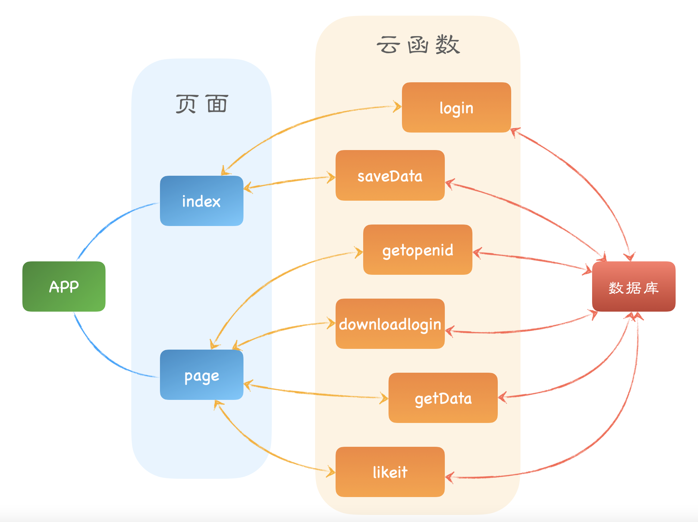

-  saveData 

    ​		这个函数主要解决我们发表我们想要说的话的时候还有我们往上面添加图片的时候我们就会调用一次*saveData*函数，这个云函数调用在*index*页面中进行调用。当用户输入了自己想要发送的信息以后，我们就会收集用户想要发送的信息，记录下用户发送该信息的时候用户写下的文字，用户上传的图片在云端存储的位置，以及用户的*openid*等等，这些在上面的集合中有提到。这个函数还是比较简单的，并不需要对用户返回什么特别的信息，我们只需要调用数据库的*add*函数然后就可以了，这是一个异步的函数也就是当用户调用这个云函数结束的时候，实际上数据库并不能保证已经结束了数据的添加，但是一点点的延迟我们是可以接受的。代码如下所示：

    ```javascript
    console.log("调用成功");
    let text = event.text;  //记录你说了什么话。
    let fileIDs = event.fileIDs;  //文件就文件的路径。
    let name = event.name;  //集合的名字。
    let time = event.time;  //记录本机时间。 
    let usrid = event.usrid; //记录用户id。
    
    let db = cloud.database();  //得到数据库的使用。
    let DB = db.collection(name); //得到我们想要的集合。
    DB.add({
        data: {
            text: text,
            fileIDs: fileIDs,
            time: time,
            createtime: db.serverDate(),
            likes: 0,  //如果喜欢为0的话到时候我们就不用怕重复点赞了。
            wholike:[],  //记录谁喜欢用户。
            usrid:usrid,
        }
    })
    return true;
    ```

-  login 

    ​		这个*login*函数就是比较有意思了，这也是我们在期中过了以后遇到的难点之一。这个*login*函数就涉及到同步和异步的问题。首先对于这个函数的介绍我们需要知道一点就是用户头像和昵称的问题。用户不可能每一次登录使用你这个软件都使用相同的昵称和用户名，所以每当用户登录这个小程序的时候，我们设计就是每一次都会更新用户昵称和头像的*url*以最大限度的保证个人信息处于最新的状态。当然，我们需要考虑到一些小小的优化。虽然我们尽可以先把原来的记录删除了（在微信小程序数据库中，如果删除的元素不存在那就不会删除也就是不会出错）然后再添加一条新的记录。但是这样会让我们进行比较大的修改。我们的想法也是比较简单和直接的，我们会先查找有没有该用户*openid*的存在，如果该用户*openid*存在，我们就用*_id*来找到这条记录修改新的昵称和头像的*url*就可以了。如果不存在再添加新的用户信息。虽然和删除一条记录增加一条记录相比，查询多了一些工作，不过我们是根据*_id*来进行查询的，而且我们的用户比较小众，用户信息较少，用户变化比较小。而数据库的写操作要耗费比较多的时间，我们这样写可以减少一些写和删除的操作。提高效率。具体代码如下所示：

    ```javascript
    let usrhead = event.usrhead;  //头像的相对路径
    let usrid = event.usrid;  //微信用户的id。
    let usrname = event.usrname;  //微信用户姓名。
    
    let db = cloud.database();  //获得数据库。
    const _ = db.command; //这个可以得到命令。
    let DB = db.collection('usr');  //得到用户数据。
    let tempdata = DB.where({
        usrid : _.eq(usrid)
    }).get(); //得到用户数据的计数。
    
    tempdata.then(async res=>{
        console.log(res);
        if(res.data.length != 0)  //如果已经存在这个用户数据了，那么就继续执行。
        {
            let oldfile = res.data[0]['usrhead']; //得到云存储的照片路径。
            let temp_id = res.data[0]['_id']; //得到我们想要的id值。
            console.log(temp_id);
            console.log(usrname);
            DB.doc(temp_id).update({
                data:{
                    usrhead : usrhead,  //更改用户头像所在地址。
                    usrname : usrname  //更新用户名字。  主要考虑到用户可能会经常改微信昵称。
                }
            });
        }
        else  //如果这个用户没有注册在案，我们需要给这个用户进行注册。
        {
            DB.add({
                data:{
                    usrhead : usrhead,  //头像文件路径。
                    usrid : usrid,  //用户的微信id。
                    usrname : usrname  //用户的姓名。
                }
            });
        }});
    return true;
    ```

    ​		这个代码需要注意的就是异步的问题。如果我们不使用*then*而是直接尝试使用结果的话。我们通过日志的打印会发现*tempdata*里面是没有东西的。所以我们涉及到返回的查询结果的使用的都要放到*then*里面去执行。

-  downloadlogin

    ​		这个函数就是传入要查询的用户的*usrid*。这个是怎么操作的呢？大概来说，就是你要显示一条言论，然后你从数据库里面得到了这条言论的相关信息也就是*mytest*中的一些记录。然后这些记录里面会有发这条信息的用户的*usrid*。我们再根据这个从数据库中查找这个用户的头像和昵称显示在页面上。逻辑不是特别复杂但是能用。具体代码如下：

    ```javascript
    console.log("begin");
    let db = cloud.database();
    let DB = db.collection('usr');
    let idlist = event.usrid; //需要的参数只有usrid就可以了。
    const _ = db.command; //得到命令；
    let info = DB.where({
        usrid : _.in(idlist)
    }).get();
    console.log("good");
    return info;
    ```

- getData 

    ​		这个函数就比较有意思了。也是我们设计的一个小功能，虽然算不得特别创新吧，但是也是有了一定的功能。这个函数就是把评论集合*mytest*中的数据一次性返回给用户。可能会有人感到奇怪了，如果一次性返回特别多的评论数据会不会影响用户的体验？我的回答是不会，这还是要感谢微信小程序给我提供的优化，就是*get()*它一次性最多返回100条数据。这样用户一次最多也只能收到100条信息了。至于其他的信息，我们如果能够继续研究的话，我们说不定可以实现信息的随机返回和信息过期处理。然后我们有评论功能，所以这给我们一个排序的可能。我们的选择比较简单，我们就用*mode*参数来标识模式。如果*mode*参数为1，那么我们的返回信息就按照时间的先后进行排序，如果mode参数为2，那么我们就按照点赞数的多少进行排序。在用户端的代码中，访问显示返回的数据是从下表为0的列表元素开始的，所以我们返回信息按时间排序的话就是最新的时间发布的显示在第一个，点赞数最多的显示在第一个，第二多的显示在第二个等以此类推。因为我们数据库修改添加应该是原子的，我们排序是根据数据库写的时间来创建的也就是在*saveData*中的那个*createtime*中有体现。所以理论上不会存在两个相同的*createtime*的记录。因此*mode*为1的时候我们根据时间来排序就行了，没必要根据点赞来排序。

    ```javascript
    let name = event.name;
    let mode = event.mode;
    let test = null;
    console.log(mode);
    console.log(name);
    if(mode == 1)
    {
        //考虑到一些问题，我们返回的时候应该是按时间从新往旧排列。
        test = cloud.database().collection(name).aggregate().sort({ 
            createtime: -1,
            //like: -1
        }).lookup({
            from: 'usr',
            localField: 'usrid',
            foreignField: 'usrid',
            as: 'usrinfor',
        }).end();
    }
    else if(mode == 2)
    {
        //考虑到一些问题，我们返回的时候应该是按时间从新往旧排列。
        test = await cloud.database().collection(name).aggregate().sort({ 
            likes: -1,
            createtime: -1
        }).lookup({
            from: 'usr',
            localField: 'usrid',
            foreignField: 'usrid',
            as: 'usrinfor',
        }).end();
    }
    else
    {
        //考虑到一些问题，我们返回的时候应该是按时间从新往旧排列。
        test = cloud.database().collection(name).aggregate().sort({ 
            createtime: -1
        }).lookup({
            from: 'usr',
            localField: 'usrid',
            foreignField: 'usrid',
            as: 'usrinfor',
        }).end();
    }
    //从结果的list读入数据。
    return test;
    ```

- likeit

    ​		这个函数也是一个查询和更新的操作。没有什么传入函数。云函数调用的时候会有用户的*openid*的参数在*openid*里面。这里我们有两个版本。一个版本是一个人不能对同一条信息点赞两次。这个实现主要是根据wholike中列表中存储的谁点赞过的功能来实现的。另一个版本是没有限制的点赞，这个版本出现是因为我们的小程序因为是社交类型的小程序，没有公司实体的支撑是没办法过审的，所以我们的用户是只能是体验版里面的成员，这个成员最多只能15个人，所以这样设置的话会让我们测试没有感觉，点赞数最多只有十几个没意思。我们就放宽了一些限制。具体代码如下：

    ```javascript
    let db = cloud.database();
    let usrid = event.userInfo.openId;
    let _id = event.id;
    let _ = db.command;
    console.log(event);
    return await db.collection('mytest').where({
        _id: _.eq(_id),
        wholike: _.not(_.all([usrid])), //这个版本限制了一个用户只能点赞一次，如果想要解除限制只需要把这句话注释即可
    }).update({
        data: {
            likes: _.inc(1), //点赞成功就自增1。
            wholike: _.push([usrid]),  //喜欢的人的列表里面就加一。
        }
    }).then(res=>{
        console.log(res);
        if(res.stats.updated == 0)
        {
            return false;
        }
        else
        {
            return true;
        }
    })
    ```

####  ⑤  数据库安全

这个项目没怎么涉及到用户隐私。而且无论你是哪一个用户，获得的信息都是一样的，所以并不存在明显的安全问题。可能的问题就是我们开放了点赞限制以后存在有人无限点赞的情况。或者过分频繁调用云函数可能会有问题。然后我们使用的是用户的*openid*来作为用户标识也不怎么存在假冒添加评论数据的情况。

### 2. 小程序主体部分

小程序主体部分主要分为3个部分。一个部分是云函数*cloud*部分，一个部分是*app*部分，还有一个部分是*Page*部分也就是网页部分。我们将大概介绍这三个部分。

#### ①  云函数部分 

云函数部分主要涉及到数据库的处理，也就是包括了上面的数据库的五个函数，那五个函数我就不多加赘述了。除了上述的五个函数以外，我还自己写了一个云函数用于获取用户的*openid*。该云函数没有返回值，该云函数如下所示：

```javascript
let data = await cloud.getWXContext();
console.log(data);
return data;
```

#### ②  App部分

这个部分没有什么实际上的功能。我们主要关心的是在*app.json*文件里面设置到相应的页面就可以了。*app.json*设置如下所示：

```json
{
  "pages": [
    "pages/index/index",
    "pages/my/my"
  ],
  "window": {
    "backgroundTextStyle": "light",
    "navigationBarBackgroundColor": "#fff",
    "navigationBarTitleText": "WeChat",
    "navigationBarTextStyle": "black"
  },
  "sitemapLocation": "sitemap.json",
  "tabBar": {
    "selectedColor": "#1296db",
    "list": [{
      "pagePath": "pages/index/index",
      "text": "发布",
      "iconPath": "images/fabu.png",
      "selectedIconPath": "images/fabued.png"
    },{
      "pagePath": "pages/my/my",
      "text": "我的",
      "iconPath": "images/my.png",
      "selectedIconPath": "images/myed.png"
    }]
  }
}
```

然后*app.js*里面只有一个*onLaunch*这个实际上是比较尴尬的，就是我里面写的东西我基本上都没什么用，因为当你在加载*app*的时候实际上第一个页面也在同时加载，这就会产生异步的问题。但是为了保险起见我还是在*app.js*里面设置了云函数的初始化和尝试获取用户信息的代码段罢了。具体代码如下所示：

```javascript
App({
  onLaunch: async function () {
    usrid:null;
    wx.cloud.init()
    wx.getSetting({
      success(res) {
        if (!res.authSetting['scope.userInfo']&&!res.authSetting['scope.userLocation']&&!res.authSetting['scope.camera']) {
          wx.authorize({
            scope: 'scope.userInfo',
            success () {
              // 用户已经授权个人信息，后续调用 wx.startRecord 接口不会弹窗询问
              wx.startRecord()
            }
          })
        }
      }
    })
  }
})
```

#### ③  Page部分

*page*部分可以看到有三个部分。第一个部分是*index*部分，也就是一开始进去我们发布的页面的部分。第二个部分是*my*部分，在这里你可以看到别人和你自己发的各种信息。第三个部分是*utils*，这个部分其实不是我自己写的，只是为了方便将得到的本机时间转化为我们比较喜欢看的时间的形式从网上下载下来的。就可以相当于一个小部件，这个小部件我就不讲述了，只是个方便的功能模块罢了。然后我将一一介绍各个部分的实现。

- index部分

    ​		一开始我们设计的页面会有一个按钮要求获取你的个人信息。这个个人信息你点击了以后我们会调用*getUserInfo*函数把你的个人信息上传到云数据库。然后我们会把已经获取用户信息的变量设置为真。然后这个按钮就不再显示了。接着*addimage*可以让我们添加图片，*closeimage*可以让我们删除那些我们已经打开的图片。然后*saveData*函数调用以后就调用数据库存储我们已经得到的值。具体代码如下：

    ```javascript
    //index.js
    //获取应用实例
    const app = getApp()
    var util = require('../utils/util.js');
    Page({
      data: {
        text: '',
        imageLists: [],
        userInfo:null,
        canIUse: wx.canIUse('button.open-type.getUserInfo'),
        hasUserInfo: false,
      },
      userDetail:1,
      onLoad: function() {
        // 查看是否授权
        let that = this;
        wx.cloud.callFunction({ //调用我自己写的云函数并且得到openid。
          name: 'getopenid',
          data:{
    
          },
          success:res1=>{ //等待程序全部完成。也就是完全得到结果。
            this.userDetail = res1;
          }
        })
      },
      bindGetUserInfo (e) {
        console.log(e.detail.userInfo)
      },
    
      fabu_text(e){
        this.setData({
          text: e.detail.value
        })
      },
      addImage(){
        let that = this;
        wx.chooseImage({
          count: 1,
          sizeType: ['original', 'compressed'],
          sourceType: ['album', 'camera'],
          success (res) {
            const tempFilePath = res.tempFilePaths[0];
            wx.cloud.uploadFile({
              cloudPath: new Date().getTime()+'.png', // 上传至云端的路径
              filePath: tempFilePath, // 小程序临时文件路径
              success: res => {
                var lists = that.data.imageLists;
                lists.push(res.fileID)
                that.setData({
                  imageLists: lists
                })
              },
              fail: console.error
            })
          }
        })
      },
      closeImage(e){
        let fileid = e.currentTarget.dataset.fileid;
        let that = this;
        wx.cloud.deleteFile({
          fileList: [fileid],
          success: res => {
            let imagelists = that.data.imageLists;
            let index = imagelists.indexOf(fileid);
            imagelists.splice(index,1);
            that.setData({
              imageLists: imagelists
            })
          },
          fail: console.error
        })
      },
      saveData(){
        let that = this;
        let temptime = util.formatTime(new Date());  //获取时间.
        console.log(this.data.userInfo);
        wx.cloud.callFunction({
          name: "saveData",
          data: {
            name: 'mytest', 
            text: that.data.text,
            fileIDs: that.data.imageLists,
            time: temptime,
            usrid:that.userDetail.result.OPENID,
          },
          success(res){
            console.log("调用成功");
            wx.showToast({
              title: '发表成功',
              icon: 'success',
              duration: 2000
            })
            that.setData({
              text: '',
              imageLists: []
            })
          },
          fail(err){
            console.log("调用失败");
          }
        })
      },
    
      getUserInfo: function(e) {
        console.log(e)
        this.userInfo = e.detail.userInfo
        this.setData({
          hasUserInfo: true
        });
        console.log(this.userInfo);
        wx.cloud.callFunction({ //调用我自己写的云函数并且得到openid。
          name: 'login',
          data:{
            usrhead:this.userInfo.avatarUrl,
            usrname:this.userInfo.nickName,
            usrid:this.userDetail.result.OPENID,
          },
        });
      }
    })
    
    ```

    页面的组织结构也就是wxml文件和css文件就不在这里展示了。

- my部分

    ​		这个部分就是从数据库中调用得到数据并且将其显示在屏幕上。但是其也不完全是输出。还是要有一个点赞功能。*getData*函数负责调用云函数得到显示的内容。*changemode*通过改变*Page*里面的结构体的*mode*决定是以怎样的形式对信息进行排序。一开始页面加载也就是*onLoad*的时候我们会调用一次*getData*，后面只有*changemode*改变排序以后我们才会再次调用*getData*。然后*thumbsup*函数就负责收集点赞的按钮信息然后自增1个点赞。需要注意的是为了方便起见，减少对远程数据库的访问量。比如你在这里点了一个赞，点赞数会在本地显示加1，然后数据库的赞也会加1。但是此时别人也点了一个赞，你的赞也只是加1的状态，可能要点击排序或者回到发布再回到我的界面来对信息进行刷新，才能得到准确的数量。

    ```javascript
    var Getdata = require('../index/index.js');
    Page({
      data: {
        dataLists: [],
        mode:1,
      },
      getData(){
        let that = this;
        wx.cloud.callFunction({
          name: 'getData',
          data:{
            name:'mytest',
            mode:that.data.mode,
          },
          success(res){
            that.setData({
              dataLists: res.result.list  //这个要用list,另外一个用data也就是get需要用data。
            });
            console.log(res.result.list);
          }
        })
      },
      //一个尝试点赞的条件。
      thumbsup: function(e){
        var temp = e.currentTarget.dataset.like + 1;
        let that = this;
        wx.cloud.callFunction({
          name: 'likeit',
          data:{
            id : e.currentTarget.dataset.id,
            //usrid : Getdata.userDetail,
          },
          success(res){
            console.log("调用likeit成功");
            console.log(res);
            if(res.result == true)
            {
            var temp1 = that.data.dataLists;
            temp1[e.currentTarget.dataset.index].likes = temp;
            that.setData({
              dataLists:temp1
            });
          }
          }
        })
      },
      changemode:function(e){
        this.setData({
          mode:e.currentTarget.dataset.mode,
        });
        console.log(this.data.mode);
        this.getData();
      },
    })
    ```

以上便是对于技术方案的所有详细解释。

## 五、后台数据库信息展示

首先，在实际运行的时候，我们可以在终端看到原始的被记录的用户信息：

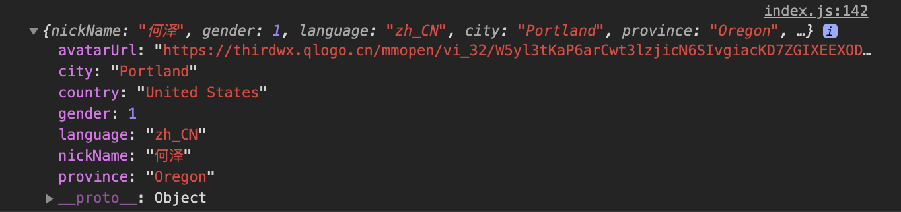

同时，所发送内容的后台数据库截图如下：

分别代表消息ID、发送时间、图片的路径、点赞数、消息内容、时间字符串、用户ID以及点赞列表

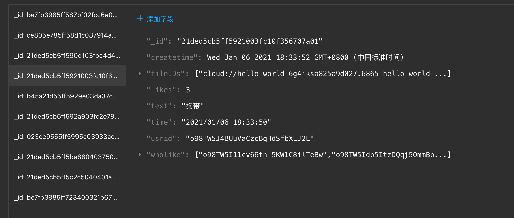

所有登录用户信息的截图：

分别代表用户ID、头像URL、openid和用户名。

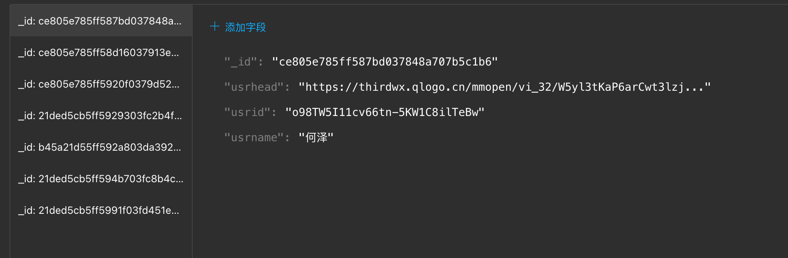

## 六、项目结果展示

- 打开后界面：

    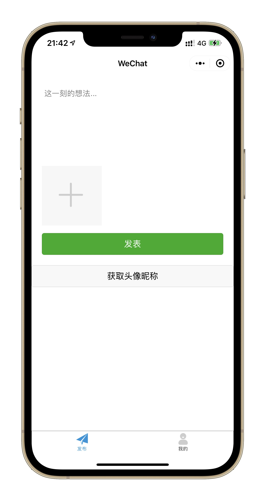

- 点击“获取头像昵称”按钮后弹窗：

    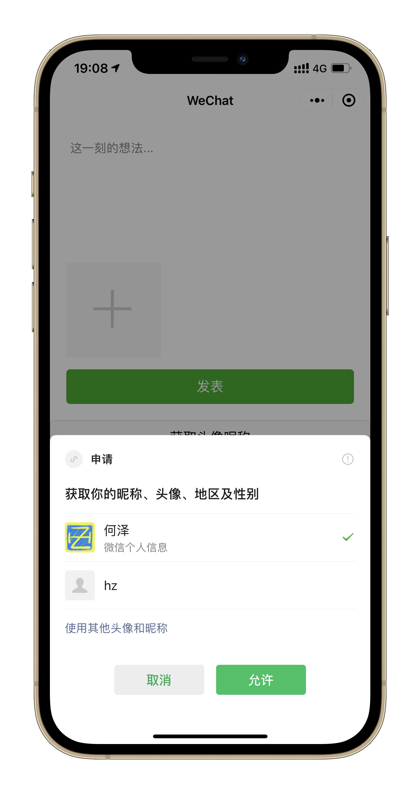

- 允许获取个人信息后获取头像按钮便会消失，之后再次进入也不会出现：

  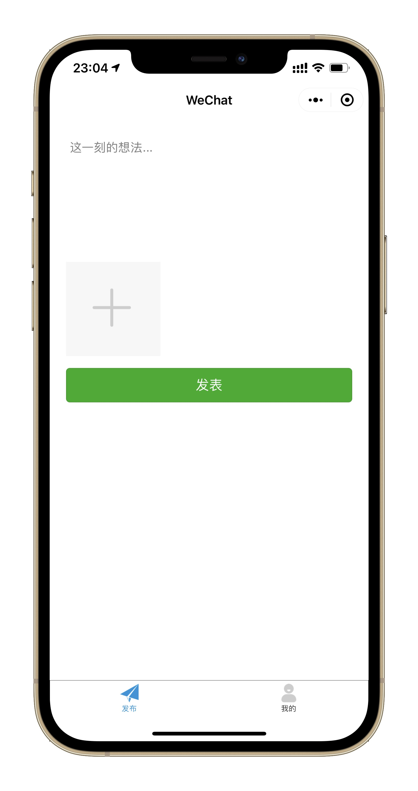

- 之后便可以发表动态：
  
  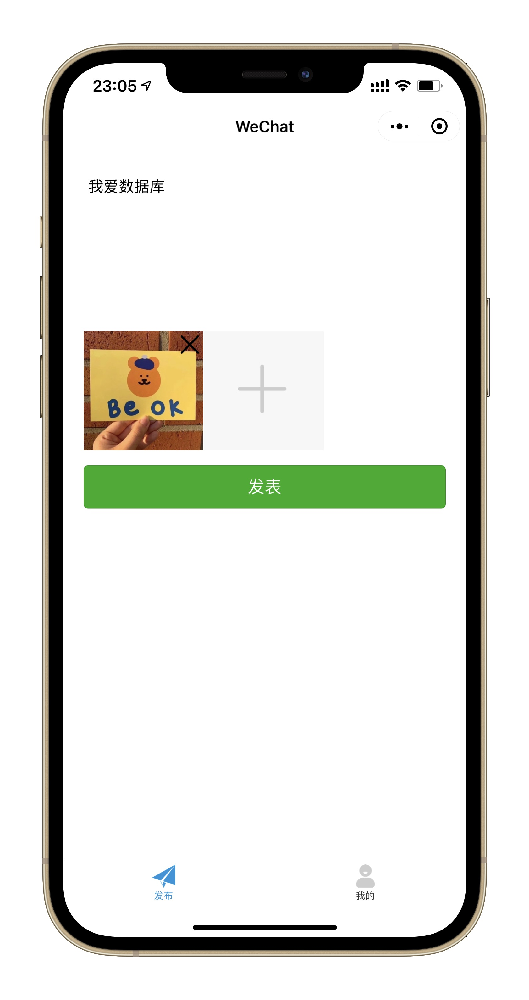

- 点击“发表”后便会提示发表成功：

    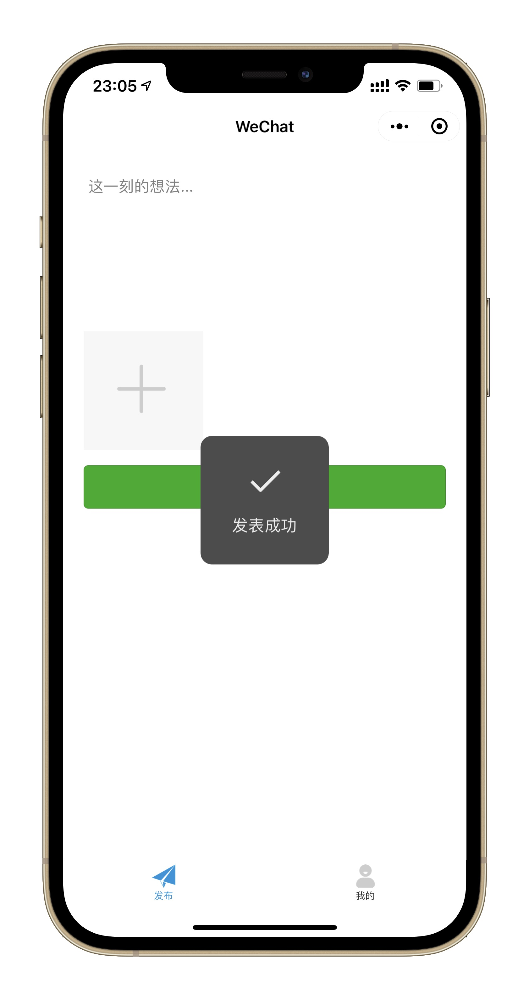

- 之后便可以在“我的”界面看到所有动态内容、发布者昵称和头像、发布时间以及点赞数，默认是按时间排序：

    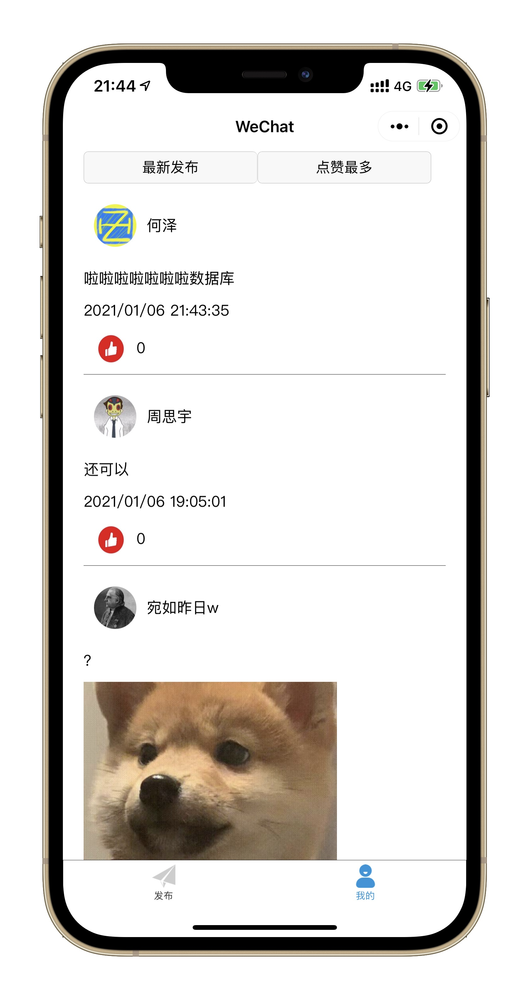

- 可以看到上面有两个按钮，可以分别依据发布时间和点赞数量进行排序：

    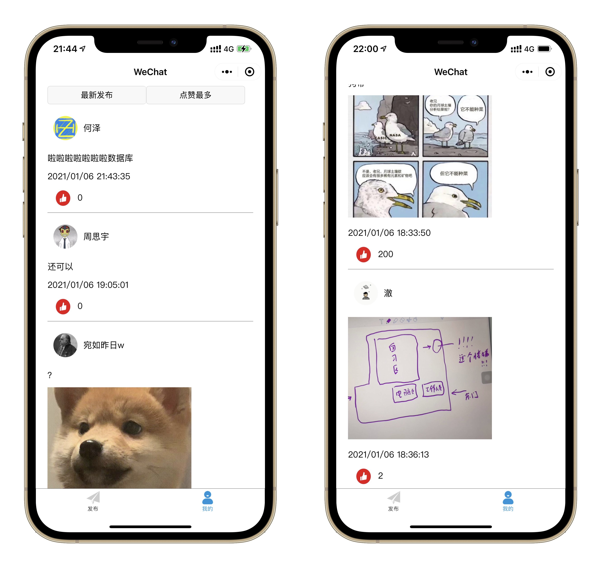

以上便是我们小程序的所有功能。

    ## 七、项目收获

这次我们的后端并没有使用到非常高级的算法。我们学习的知识涉及到推荐的还比较少。我们主要的时间都花费在如何同*javascript*编程和微信小程序的组织以及微信小程序特性的搏斗上。而且我们人数比较少，只有两个人。我们班微信群有46个人，除去老师和助教剩下43个人，所以是不可能每一个组都有三个人的配置的。两个人每周利用一些时间跑小程序，学习相应的语法知识。有时候有些难题一周还想不出来就到下一周了。

虽然我们期中实现了一个雏形，但是也参考了别人的一些代码。当我们想做更多功能的时候，我们参考的代码就会越来越零碎也变得越来越难。如果我们没有浪费太多的时间在微信小程序的学习上面，想必能够抽出更多的时间去设计后端的代码了吧。

但是，我们学会了微信小程序的开发流程和文件组织。在这个过程中，我们也学习了网页的编程。虽然微信是*wxml*和*html*不是完全相同，但是大体也是差不太多的。

然后现在也是可以选下学期的课程了。下学期有一门专选叫专业技术综合实践就是教你怎么写微信小程序的，而且主要是前端方面的，看了一下最后大作业也是做一个微信小程序。可惜我没能选上。不过这学期我通过数据库的实验课自学了这些知识，也是很有成就感的。

## 八、项目总结

其实我们之前没有任何关于微信小程序的经验，也从来没有接触过*web*类的编程，解释型编程语言也不怎么接触过，主要接触过的就是*c/c++*和*python*。在刚开始这个项目的时候，我们能做的就是去参考别人的代码，从别人的代码中观察语言的使用和规律。这是一个非常漫长的过程，可能一个看上去比较简单的功能，因为不明白其中的逻辑，所以会产生一些意想不到的内容，犯了很多的错误。这之中最为困难的技术难题毫无疑问是同步和异步的问题。同步和异步困扰着我们很久。用了好几个星期去解决同步和异步的问题。因为微信小程序是一个网络应用。网络应用会存在延迟，微信小程序为了优化这个问题，使用了了很多异步的操作。这样会带来许多意想不到的效果。

所以在这之中就是不断发现问题然后解决问题的过程，对于编程语言完全不了解对问题，起初我们是看了很多的别人的代码和官方文档，在实际调试对时候使用*console.log()*来慢慢摸索使用方法。另外*api*的了解是非常感谢微信小程序的官方文档特别是云开发中数据库的*api*的使用介绍的非常详细，很多功能都有支持而且写的比较详细。困扰最多的同步和异步的问题，这个异步确实比较麻烦。虽然这些异步会屏蔽掉很多延迟，但是对编程人员来说是比较不友好的。有时候你顺序上已经赋值的变量结果完全没有被赋值就被你理论上应该是后面的程序使用了。这很奇怪。一种奇怪的语法就是用*then*这种方法来进行操作。但是方法有很多种，还有回调这些类似的名词。可能是我没学过*js*的原因吧，反正听的云里雾里。微信小程序开发也隔一段时间添加一些不一样的语法。然后有时候你查到的几年前的网页的代码还可能有*bug*这就很奇怪。如果官方文档能够解决的更好一点就好了。我的总结就是尽量在"res=>{}"这种里面写。这里的语法有很多种我就不一一介绍了。用*await*我从来都没有用出想要的效果，感觉还是语言学的不够深。但是我这样处理同步和异步的问题已经能够支撑起这个小程序的正常运行了。

还好最后我们还是做出了这样的一个版本，这之中虽然遇到了不少困难，但现在我们除了熟悉了小程序的开发之外，最重要的是更加熟悉了数据库的操作，将课堂上学习的内容实际操作，对数据库的理解也随之加深了。总之，这一个小程序对我们理解数据库的帮助是很大的，我们俩也受益匪浅。

